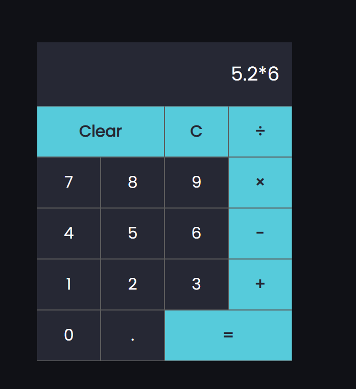

# React Calculator (Dark Theme)

A simple calculator built with React featuring a dark theme.
This project was created as a practice exercise to learn React fundamentals and implement a clean, responsive user interface.

##🚀 Features

✅ Dark theme for a modern and attractive look
✅ Basic mathematical operations: addition, subtraction, multiplication, division
✅ Responsive UI for desktop and mobile
✅ Uses React hooks for state management
✅ Clean and structured code for easy readability

- demo pic
---

---

