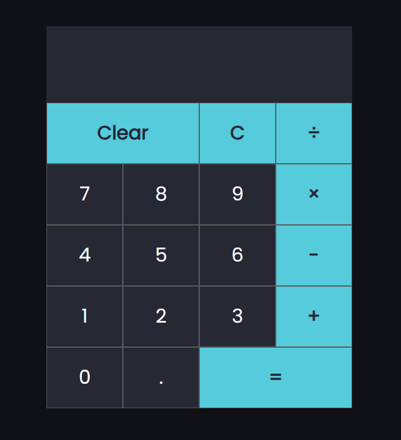

# ماشین حساب با React (تم دارک)

این یک ماشین حساب ساده است که با استفاده از React ساخته شده و دارای تم دارک است. این پروژه برای تمرین و یادگیری React طراحی شده و شامل قابلیت‌های اساسی یک ماشین حساب معمولی می‌باشد.

## ویژگی‌ها
✅ تم دارک برای ظاهری جذاب  
✅ عملیات پایه‌ای ریاضی شامل جمع، تفریق، ضرب و تقسیم  
✅ رابط کاربری واکنش‌گرا (Responsive UI)  
✅ استفاده از هوک‌های React برای مدیریت وضعیت  
✅ کدنویسی تمیز و ساختارمند

- demo pic
---

---

